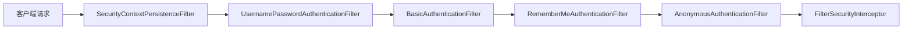
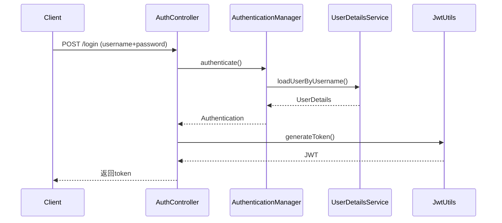
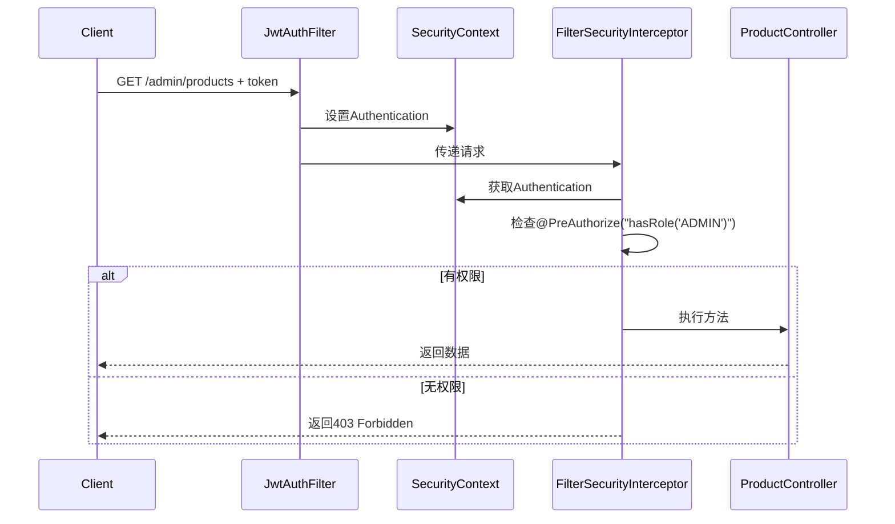

### Spring Security入门指南

#### 一、核心实现原理
Spring Security基于**过滤器链（Filter Chain）**实现安全控制，当请求到达Servlet容器时，会经过20多个内置过滤器（按顺序执行）。关键过滤器包括：

1. **SecurityContextPersistenceFilter**：安全上下文存储
2. **UsernamePasswordAuthenticationFilter**：表单登录处理
3. **FilterSecurityInterceptor**：访问控制决策
4. **ExceptionTranslationFilter**：安全异常处理



#### 二、核心概念
1. **Authentication**：认证信息（用户名、密码、权限）
2. **SecurityContext**：存储Authentication的容器
3. **UserDetails**：用户信息核心接口
4. **GrantedAuthority**：用户权限标识
5. **AuthenticationManager**：认证入口点

---

### 路线1：登录流程（login → token）

#### 1. 添加Maven依赖
```xml
<dependencies>
    <dependency>
        <groupId>org.springframework.boot</groupId>
        <artifactId>spring-boot-starter-security</artifactId>
    </dependency>
    <dependency>
        <groupId>io.jsonwebtoken</groupId>
        <artifactId>jjwt</artifactId>
        <version>0.11.5</version>
    </dependency>
</dependencies>
```

#### 2. JWT工具类
```java
public class JwtUtils {
    private static final String SECRET_KEY = "mySecretKey123!@#";
    private static final long EXPIRATION = 86400000; // 24小时

    public static String generateToken(UserDetails userDetails) {
        return Jwts.builder()
                .setSubject(userDetails.getUsername())
                .setIssuedAt(new Date())
                .setExpiration(new Date(System.currentTimeMillis() + EXPIRATION))
                .signWith(SignatureAlgorithm.HS512, SECRET_KEY)
                .compact();
    }

    public static String extractUsername(String token) {
        return Jwts.parser()
                .setSigningKey(SECRET_KEY)
                .parseClaimsJws(token)
                .getBody()
                .getSubject();
    }
}
```

#### 3. 自定义UserDetailsService
```java
@Service
public class CustomUserDetailsService implements UserDetailsService {

    @Override
    public UserDetails loadUserByUsername(String username) {
        // 实际项目从数据库查询
        if ("admin".equals(username)) {
            return new User("admin", 
                           passwordEncoder().encode("admin123"),
                           AuthorityUtils.createAuthorityList("ROLE_ADMIN"));
        }
        throw new UsernameNotFoundException("用户不存在");
    }

    @Bean
    public PasswordEncoder passwordEncoder() {
        return new BCryptPasswordEncoder();
    }
}
```

#### 4. 登录控制器
```java
@RestController
public class AuthController {
    
    @Autowired
    private AuthenticationManager authenticationManager;
    
    @PostMapping("/login")
    public ResponseEntity<?> login(@RequestBody LoginRequest request) {
        // 1. 认证流程
        Authentication authentication = authenticationManager.authenticate(
            new UsernamePasswordAuthenticationToken(
                request.getUsername(), 
                request.getPassword()
            )
        );
        
        // 2. 生成JWT
        SecurityContextHolder.getContext().setAuthentication(authentication);
        UserDetails userDetails = (UserDetails) authentication.getPrincipal();
        String token = JwtUtils.generateToken(userDetails);
        
        return ResponseEntity.ok(Map.of("token", token));
    }
}

// DTO类
public class LoginRequest {
    private String username;
    private String password;
    // getters/setters
}
```

#### 5. 安全配置
```java
@Configuration
@EnableWebSecurity
public class SecurityConfig extends WebSecurityConfigurerAdapter {

    @Override
    protected void configure(HttpSecurity http) throws Exception {
        http
            .csrf().disable()
            .sessionManagement().sessionCreationPolicy(SessionCreationPolicy.STATELESS)
            .and()
            .authorizeRequests()
            .antMatchers("/login").permitAll()
            .anyRequest().authenticated()
            .and()
            .addFilterBefore(jwtAuthenticationFilter(), UsernamePasswordAuthenticationFilter.class);
    }

    @Bean
    public JwtAuthenticationFilter jwtAuthenticationFilter() {
        return new JwtAuthenticationFilter();
    }

    @Bean
    @Override
    public AuthenticationManager authenticationManagerBean() throws Exception {
        return super.authenticationManagerBean();
    }
}
```

#### 6. JWT认证过滤器
```java
public class JwtAuthenticationFilter extends OncePerRequestFilter {

    @Override
    protected void doFilterInternal(HttpServletRequest request, 
                                    HttpServletResponse response, 
                                    FilterChain filterChain) 
        throws ServletException, IOException {
        
        // 1. 从Header提取token
        String header = request.getHeader("Authorization");
        if (header == null || !header.startsWith("Bearer ")) {
            filterChain.doFilter(request, response);
            return;
        }

        String token = header.substring(7);
        
        // 2. 验证并解析token
        if (JwtUtils.validateToken(token)) {
            String username = JwtUtils.extractUsername(token);
            
            // 3. 构建Authentication对象
            UserDetails userDetails = customUserDetailsService.loadUserByUsername(username);
            UsernamePasswordAuthenticationToken authentication = 
                new UsernamePasswordAuthenticationToken(
                    userDetails, 
                    null, 
                    userDetails.getAuthorities()
                );
            
            // 4. 存入SecurityContext
            SecurityContextHolder.getContext().setAuthentication(authentication);
        }
        
        filterChain.doFilter(request, response);
    }
}
```

#### 登录流程时序图


---

### 路线2：接口访问流程（请求 → 权限解析）

#### 1. 带权限检查的控制器
```java
@RestController
public class ProductController {

    // 需要ADMIN角色
    @PreAuthorize("hasRole('ADMIN')")
    @GetMapping("/admin/products")
    public List<Product> getAdminProducts() {
        return productService.getAllProducts();
    }

    // 需要USER角色
    @PreAuthorize("hasRole('USER')")
    @GetMapping("/user/products")
    public List<Product> getUserProducts() {
        return productService.getUserProducts();
    }
}
```

#### 2. 访问流程解析
1. **请求到达**：携带`Authorization: Bearer <token>`
2. **JwtAuthenticationFilter**：
    - 提取token
    - 验证签名
    - 解析用户名
    - 加载用户权限
    - 构建Authentication对象
3. **FilterSecurityInterceptor**：
    - 从SecurityContext获取Authentication
    - 检查@PreAuthorize注解要求
    - 比对用户权限
4. **访问控制决策**：
    - 权限足够 → 执行控制器方法
    - 权限不足 → 抛出AccessDeniedException

#### 3. 权限检查流程时序图


#### 4. 权限元数据存储方式
Spring Security支持三种权限配置方式：
```java
// 方式1：注解配置（推荐）
@PreAuthorize("hasAuthority('PRODUCT_READ')")

// 方式2：HttpSecurity配置
http.authorizeRequests()
    .antMatchers("/admin/**").hasRole("ADMIN")
    .antMatchers("/user/**").hasAnyRole("USER", "ADMIN")

// 方式3：实现AccessDecisionVoter
public class CustomVoter implements AccessDecisionVoter {
    // 自定义投票逻辑
}
```

---

### 三、核心业务逻辑解析

#### 1. 认证过程（Authentication）
```java
// 认证流程伪代码
public Authentication authenticate(Authentication authRequest) {
    // 1. 根据用户名加载用户
    UserDetails user = userDetailsService.loadUserByUsername(authRequest.getName());
    
    // 2. 校验密码
    if (!passwordEncoder.matches(authRequest.getCredentials(), user.getPassword())) {
        throw new BadCredentialsException("密码错误");
    }
    
    // 3. 构建完整Authentication对象
    return new UsernamePasswordAuthenticationToken(
        user, 
        null, 
        user.getAuthorities() // 权限列表
    );
}
```

#### 2. 授权过程（Authorization）
```java
// 授权决策伪代码
public void decide(Authentication auth, Object object, Collection<ConfigAttribute> attributes) {
    for (ConfigAttribute attribute : attributes) {
        // 检查所需权限
        String requiredRole = attribute.getAttribute();
        
        // 遍历用户权限
        for (GrantedAuthority authority : auth.getAuthorities()) {
            if (requiredRole.equals(authority.getAuthority())) {
                return; // 权限匹配，允许访问
            }
        }
    }
    
    throw new AccessDeniedException("权限不足");
}
```

---

### 四、最佳实践建议

1. **密码存储**：始终使用`BCryptPasswordEncoder`
   ```java
   @Bean
   public PasswordEncoder passwordEncoder() {
       return new BCryptPasswordEncoder(12);
   }
   ```

2. **权限设计**：
    - 使用`ROLE_`前缀表示角色
    - 细粒度权限用`SCOPE_`前缀
   ```java
   AuthorityUtils.createAuthorityList("ROLE_ADMIN", "SCOPE_product:write")
   ```

3. **安全配置**：
   ```java
   http
     .cors().and()  // 启用CORS
     .csrf().disable() // API服务建议禁用CSRF
     .formLogin().disable() // 禁用表单登录
     .httpBasic().disable() // 禁用Basic认证
     .sessionManagement().sessionCreationPolicy(STATELESS) // 无状态
   ```

4. **异常处理**：
   ```java
   @ControllerAdvice
   public class SecurityExceptionHandler {
       @ExceptionHandler(AccessDeniedException.class)
       public ResponseEntity<?> handleAccessDenied() {
           return ResponseEntity.status(403).body("权限不足");
       }
       
       @ExceptionHandler(AuthenticationException.class)
       public ResponseEntity<?> handleAuthFailed() {
           return ResponseEntity.status(401).body("认证失败");
       }
   }
   ```

---

### 五、常见问题解决方案

1. **循环依赖问题**：
   ```java
   // 错误：在SecurityConfig中注入AuthenticationManager
   // 正确方式：
   @Bean
   @Override
   public AuthenticationManager authenticationManagerBean() throws Exception {
       return super.authenticationManagerBean();
   }
   ```

2. **权限不生效**：
    - 检查`@EnableGlobalMethodSecurity(prePostEnabled = true)`
    - 确认过滤器链顺序正确

3. **JWT失效问题**：
    - 检查服务端密钥一致性
    - 验证令牌过期时间（exp claim）
    - 使用在线工具（jwt.io）调试

4. **用户上下文丢失**：
    - 确保在异步线程中传递SecurityContext
   ```java
   SecurityContext context = SecurityContextHolder.getContext();
   // 异步执行
   CompletableFuture.runAsync(() -> {
       SecurityContextHolder.setContext(context);
       // 业务代码
   });
   ```

> 本文针对已熟悉Spring Boot的开发者，详细介绍了Spring Security的核心机制和JWT集成方案。实际项目中还需考虑刷新令牌、权限缓存、审计日志等进阶功能。建议结合Spring Security官方文档和示例项目进行深度实践。